<p align="center">
  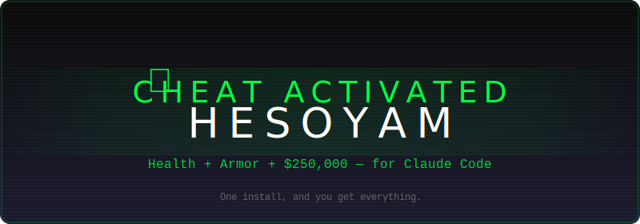
</p>

<p align="center">
<pre align="center">
    ██╗  ██╗███████╗███████╗ ██████╗ ██╗   ██╗ █████╗ ███╗   ███╗
    ██║  ██║██╔════╝██╔════╝██╔═══██╗╚██╗ ██╔╝██╔══██╗████╗ ████║
    ███████║█████╗  ███████╗██║   ██║ ╚████╔╝ ███████║██╔████╔██║
    ██╔══██║██╔══╝  ╚════██║██║   ██║  ╚██╔╝  ██╔══██║██║╚██╔╝██║
    ██║  ██║███████╗███████║╚██████╔╝   ██║   ██║  ██║██║ ╚═╝ ██║
    ╚═╝  ╚═╝╚══════╝╚══════╝ ╚═════╝    ╚═╝   ╚═╝  ╚═╝╚═╝     ╚═╝
                    for Claude Code
</pre>
</p>

### 🎮 Health. Armor. $250K. The cheat code for Claude Code.

> *In GTA San Andreas, typing `HESOYAM` gave you full health, full armor, and $250,000 — instantly. No grinding. No side quests. Just everything you need to dominate.*
>
> *This repo is HESOYAM for Claude Code. One install, and you get orchestration, configuration, memory, knowledge, and ecosystem discovery — the complete cheat code for AI-powered development.*

<p align="center">
  
  
  
  
  
  
</p>

<p align="center">
  <b>Health (Memory) · Armor (Security) · $250K (Productivity) · Cheat Activated</b>
</p>

<p align="center">
  <a href="#-the-five-cheats">The Cheats</a> · <a href="#-quick-start">Quick Start</a> · <a href="#-pillar-i--orchestration-the-250k">The $250K</a> · <a href="#️-pillar-ii--configuration--security-the-armor">The Armor</a> · <a href="#️-pillar-iii--memory--persistence-the-health-bar">The Health Bar</a> · <a href="#-pillar-iv--knowledge--second-brain-the-safe-house">The Safe House</a> · <a href="#️-pillar-v--discovery--ecosystem-the-map">The Map</a> · <a href="#-contributing">Contributing</a>
</p>

> **🛤️ Don't need all five pillars?** Read **[Pick Your Path](guides/pick-your-path.md)** to find the right setup for you — from minimal (Claude Code only, 15 min) to full stack (everything, 45 min). **Obsidian is optional.** Every path works without it.

---

## 🎮 What Is This?

> *Remember the feeling of typing a cheat code and watching everything change? That's this repo.*

Most Claude Code repos solve **one** problem. HESOYAM solves **all five** — like entering a cheat code that gives you max health, infinite ammo, AND a tank at the same time.

You shouldn't need six browser tabs, four GitHub repos, and a prayer to get Claude Code working the way your brain thinks. HESOYAM combines the best open-source projects in the Claude Code ecosystem — each one legendary in its own right — into a unified reference architecture with opinionated guides, install scripts, and interoperability patterns that make them work **together**.

**Think of it like the GTA cheat sheet you kept bookmarked:**

| GTA Cheat | What It Did | HESOYAM Equivalent |
|-----------|-------------|-------------------|
| `HESOYAM` | Health + Armor + $250K | Full stack install — everything you need |
| `UZUMYMW` | All weapons | 32 agents + 150 skills (via upstream) + 8 stack configs |
| `FULLCLIP` | Unlimited ammo | Persistent memory — context never runs out |
| `BAGUVIX` | Infinite health | Security hooks — your code can't be killed |
| `AEZAKMI` | Never wanted | Auto-sync — bugs and tech debt can't find you |

This isn't a fork. It's a **cheat code**.

<p align="center">
  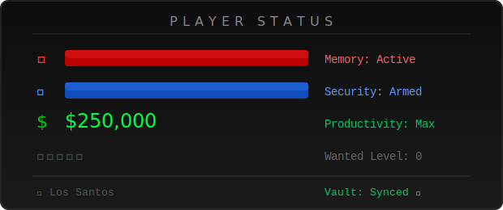
</p>

> **Important:** HESOYAM is a **bootstrap kit and reference architecture** — it coordinates installation and configuration of best-in-class upstream projects. The agents, skills, and orchestration features come from those upstream projects (oh-my-claudecode, everything-claude-code, claude-mem, etc.). HESOYAM itself provides: the unified installer, 4 integration skills, 6 playbooks, 8 stack configs, 11 guides, an Obsidian vault template, and the glue that makes everything work together.

---

## 🏙️ How It All Fits Together

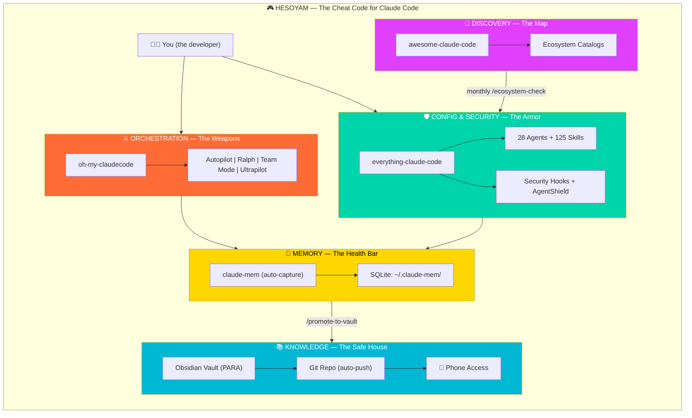

---

## 🚲 ➡️ ✈️ Day 1 vs. Day 50 — What Changes

### 🚲 Day 1: CJ on a bicycle — You just typed HESOYAM

```
Your Claude Code setup:
├── .claude/
│   └── skills/                    ← 4 HESOYAM skills installed
│       ├── promote-to-vault.md
│       ├── daily-standup.md
│       ├── research-sprint.md
│       └── ecosystem-check.md
├── ~/Documents/obsidian-vault/    ← Empty PARA template
│   ├── 00_Inbox/                  (empty)
│   ├── 01_Projects/               (empty)
│   ├── 02_Areas/                  (empty)
│   ├── 03_Resources/              (empty)
│   ├── 04_Archive/                (empty)
│   └── 06_Templates/             ← 4 templates ready
└── ~/.claude-mem/
    └── claude-mem.db              ← First session captured

Total knowledge: ~0
Claude knows about you: nothing
Vault commits: 1 (initial template)
```

**How it feels:** 🚲 Like starting a new GTA save. Clean map. No territory. But you've got the cheat codes entered.

### ✈️ Day 50: CJ in a Hydra jet — Two months of HESOYAM

```
Your Claude Code setup:
├── .claude/
│   └── skills/                    ← 4 skills + any custom ones you added
├── ~/Documents/obsidian-vault/    ← A living knowledge base
│   ├── 00_Inbox/
│   │   └── random-thought-2026-03-28.md
│   ├── 01_Projects/
│   │   ├── acme-api/
│   │   │   ├── decisions/
│   │   │   │   ├── adr-001-chose-postgresql.md
│   │   │   │   ├── adr-002-jwt-over-sessions.md
│   │   │   │   └── adr-003-event-sourcing-for-billing.md
│   │   │   ├── meetings/
│   │   │   │   ├── 2026-02-03-kickoff.md
│   │   │   │   ├── 2026-02-17-sprint-review.md
│   │   │   │   └── 2026-03-01-architecture-review.md
│   │   │   └── dailies/
│   │   │       ├── 2026-03-25.md
│   │   │       ├── 2026-03-26.md
│   │   │       └── 2026-03-27.md
│   │   ├── mobile-app/
│   │   │   ├── decisions/
│   │   │   │   └── adr-001-react-native-over-flutter.md
│   │   │   └── spike-offline-sync.md
│   │   └── internal-dashboard/
│   │       └── decisions/
│   │           └── adr-001-chose-nextjs.md
│   ├── 02_Areas/
│   │   ├── architecture/
│   │   │   ├── microservices-patterns.md
│   │   │   └── api-versioning-strategy.md
│   │   └── team-management/
│   │       └── onboarding-checklist.md
│   ├── 03_Resources/
│   │   ├── debugging-journal/
│   │   │   ├── 2026-02-12-payment-webhook-race.md
│   │   │   ├── 2026-02-28-n+1-query-in-dashboard.md
│   │   │   └── 2026-03-15-jwt-expiry-edge-case.md
│   │   ├── patterns/
│   │   │   ├── retry-with-exponential-backoff.md
│   │   │   ├── repository-pattern-sqlalchemy.md
│   │   │   └── react-error-boundary-pattern.md
│   │   └── tech-decisions/
│   │       ├── evaluation-queue-systems.md
│   │       └── evaluation-search-engines.md
│   ├── 04_Archive/
│   │   └── old-auth-system/           ← Completed migration
│   └── 06_Templates/
└── ~/.claude-mem/
    └── claude-mem.db              ← 50 days of sessions

Total knowledge: 47 notes, 8 ADRs, 3 debug journals, 3 patterns
Claude knows about you: your stack, your decisions, your bugs, your patterns
Vault commits: 200+ (auto-synced)
On your phone: everything, always
```

**How it feels:** ✈️ Like having a 5-star wanted level cleared. You've mapped the city. You own territory. Claude Code starts every session already knowing your codebase, your decisions, and your debugging history. New team members clone the vault and skip 2 months of context-building.

### 📸 See It In Action

> *Real screenshots from a production HESOYAM setup — not mockups.*

<p align="center">
  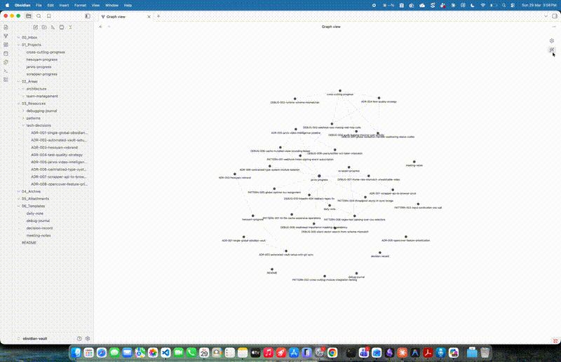
  <br/><sub><i>The cheat code in action: /promote-to-vault classifying and saving knowledge</i></sub>
</p>

<details>
<summary><b>🗂️ Obsidian Vault — The Second Brain (click to expand)</b></summary>
<br/>

**PARA-structured vault with real ADRs, debug journals, patterns, and project milestones:**

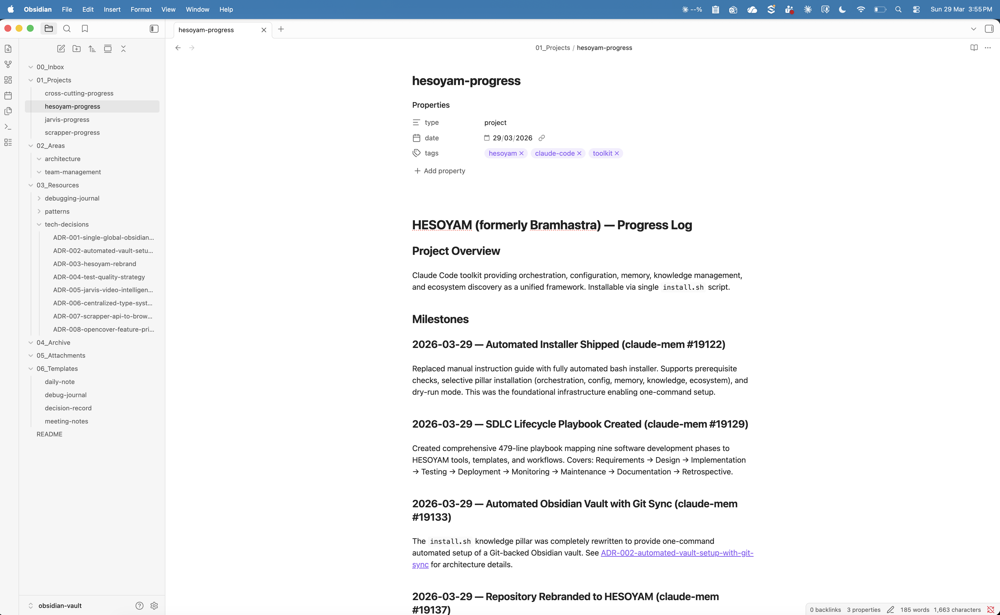

</details>

<details>
<summary><b>📋 Architecture Decision Records — Knowledge That Compounds</b></summary>
<br/>

**Every significant decision captured with Context, Options, Decision, and Rationale:**

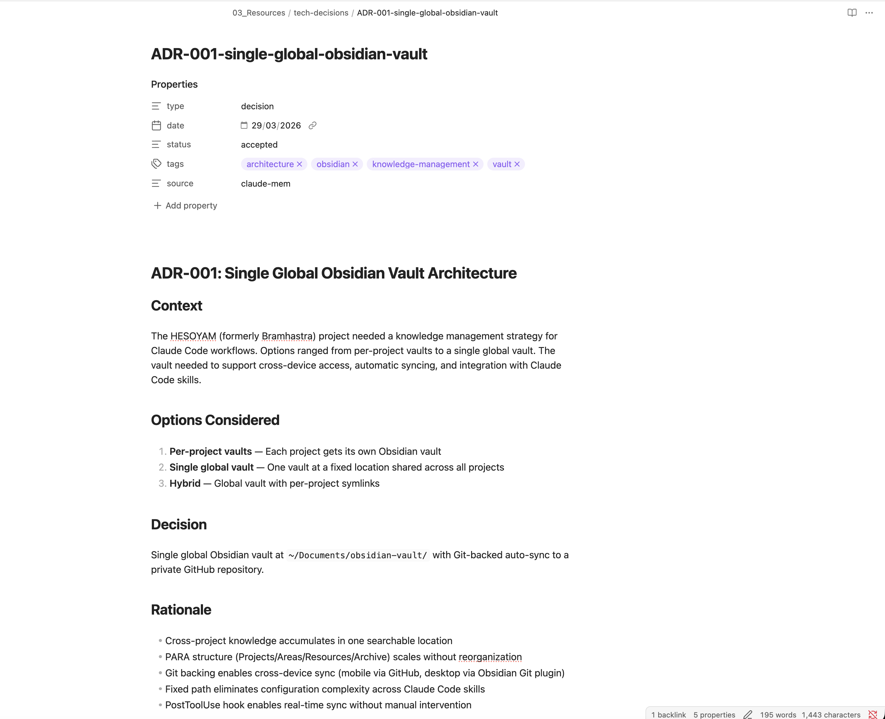

</details>

<details>
<summary><b>🕸️ Knowledge Graph — Your Brain, Visualized</b></summary>
<br/>

**Obsidian graph view showing interconnected ADRs, debug journals, patterns, and projects:**

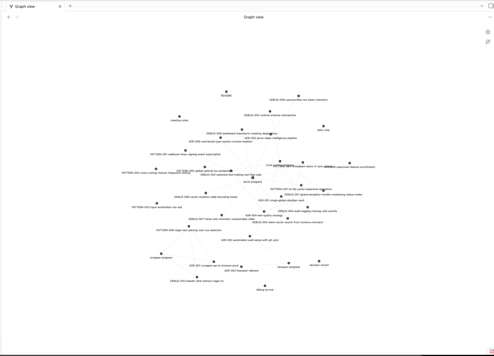

</details>

<details>
<summary><b>⚡ /promote-to-vault — The Cheat Code in Action</b></summary>
<br/>

**Claude Code auto-classifying observations and writing ADRs directly to your vault:**

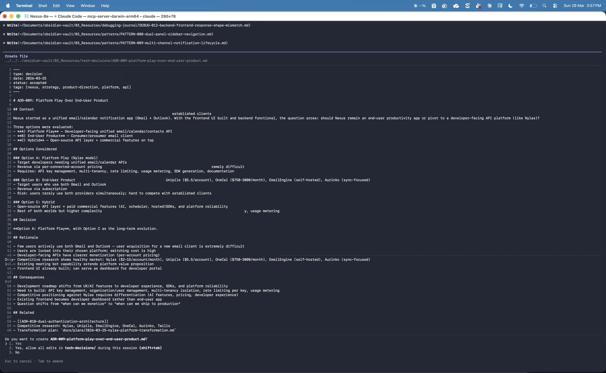

</details>

<details>
<summary><b>📊 claude-mem Timeline — Total Recall</b></summary>
<br/>

**Every session captured, indexed, and searchable — 430K+ tokens of institutional memory:**

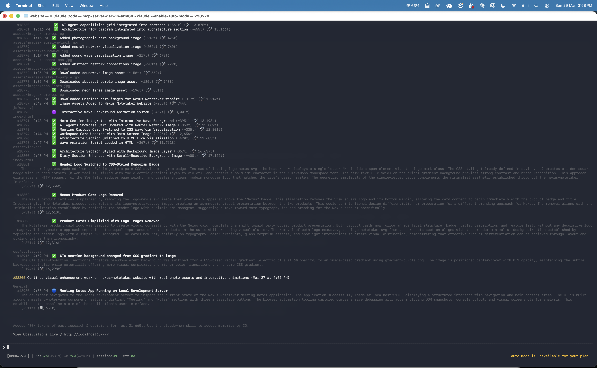

</details>

### The Compound Effect

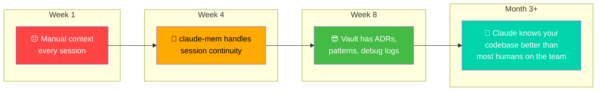

---

## 🎰 The Five Cheats

| Pillar | The Problem | The Cheat | Powered By |
|--------|-------------|-----------|------------|
| ❤️ **Memory** — *The Health Bar* | 200K context window, zero memory between sessions | Auto-capture, AI compression, semantic search, session continuity — your health never drops | [claude-mem](https://github.com/thedotmack/claude-mem) + [claude-brain](https://github.com/memvid/claude-brain) |
| 🛡️ **Security** — *The Armor* | No guardrails, no standards, no cross-tool portability | 28 agents, 125 skills, hooks, security scanning — nothing gets through | [everything-claude-code](https://github.com/affaan-m/everything-claude-code) |
| 💲 **Orchestration** — *The $250K* | Claude Code is single-agent by default | Multi-agent parallel execution, autonomous loops — instant productivity | [oh-my-claudecode](https://github.com/Yeachan-Heo/oh-my-claudecode) |
| 💾 **Knowledge** — *The Safe House* | Context dies when the terminal closes | Obsidian vault as persistent second brain, auto-synced to GitHub — your progress is always saved | [obsidian-skills](https://github.com/kepano/obsidian-skills) + [notebooklm-py](https://github.com/teng-lin/notebooklm-py) + [claudesidian](https://github.com/heyitsnoah/claudesidian) |
| 🗺️ **Discovery** — *The Map* | You don't know what you don't know | Curated catalog of 500+ tools, skills, agents, and plugins — the whole city revealed | [awesome-claude-code](https://github.com/hesreallyhim/awesome-claude-code) + [awesome-notebooklm](https://github.com/etewiah/awesome-notebooklm) |

---

## ⚡ Quick Start

### Option 1: Full Installation (Recommended)

```bash
# Clone the arsenal
git clone https://github.com/Shashank2577/hesoyam-for-claude-code.git
cd hesoyam-for-claude-code

# Preview what will be installed (no changes made)
./install.sh --dry-run

# Run the unified installer
./install.sh

# Or install pillar by pillar
./install.sh --pillar orchestration
./install.sh --pillar config
./install.sh --pillar memory
./install.sh --pillar knowledge
./install.sh --pillar discovery

# Custom vault path
./install.sh --vault-path ~/my-obsidian-vault
```

> See [COMPATIBILITY.md](COMPATIBILITY.md) for version requirements and token budget estimates.

### Option 2: Plugin Marketplace (Individual Pillars)

```bash
# Inside Claude Code:

# Orchestration
/plugin marketplace add Yeachan-Heo/oh-my-claudecode
/plugin install oh-my-claudecode@omc

# Configuration & Security
/plugin marketplace add affaan-m/everything-claude-code
/plugin install everything-claude-code@everything-claude-code

# Memory
/plugin marketplace add thedotmack/claude-mem
/plugin install claude-mem

# Knowledge (Obsidian Skills)
/plugin marketplace add kepano/obsidian-skills
/plugin install obsidian@obsidian-skills
```

### Option 3: Cherry-Pick What You Need

Read the pillar guides below. Take what serves you. Leave the rest. Come back when you're ready.

---

## 💲 Pillar I — Orchestration (The $250K)

### The Engine: [oh-my-claudecode](https://github.com/Yeachan-Heo/oh-my-claudecode)

> *"You don't prompt anymore. You orchestrate."*

oh-my-claudecode transforms Claude Code from a single-agent terminal into a **multi-agent execution engine** with 32 specialized agents and 31+ skills. Workers spawn on demand and die when their task completes — zero idle resources.

**Five Execution Modes:**

| Mode | What It Does | When to Use |
|------|-------------|-------------|
| **Autopilot** | Full autonomous execution. Self-referential loop until completion with architect verification. | You have a clear spec and want to walk away |
| **Ultrapilot** | Maximum parallelism with aggressive agent delegation. 3-5x throughput. | Large feature with many independent subtasks |
| **Deep Interview** | Socratic questioning to expose hidden assumptions before code is written. | Vague requirements, early-stage ideation |
| **Swarm** | N coordinated agents on a shared task list using Claude Code native teams. | Complex refactoring, migration work |
| **Ecomode** | Token-efficient execution for budget-conscious runs. | Long sessions, cost-sensitive projects |

**Multi-Model Orchestration:**

```bash
# Route architecture review to Codex, UI review to Gemini, Claude synthesizes
/ccg Review this PR — architecture (Codex) and UI components (Gemini)
```

**HESOYAM Cheat Unlocked — Orchestration Playbooks:**

```
hesoyam/
├── playbooks/
│   ├── sdlc-lifecycle.md          # ⭐ Full IT company SDLC (9 phases, end-to-end)
│   ├── greenfield-feature.md      # Interview → Plan → Swarm → Review
│   ├── legacy-migration.md        # Recon → Autopilot → Validate
│   ├── bug-hunt.md                # Deep Interview → Targeted Fix → TDD
│   ├── code-review-pipeline.md    # Parallel reviewers → Synthesis
│   └── sprint-execution.md        # Ultrapilot with daily checkpoints
```

**Features People Actually Use Daily** (see [guides/daily-usage.md](guides/daily-usage.md)):

| Feature | What It Does | Why It's Killer |
|---------|-------------|-----------------|
| **Ralph Mode** | Planning + relentless execution in one command | 90% of real OMC usage. Replaces Interview + Autopilot |
| **HUD** | Real-time token usage & rate limit monitoring | Predict when you'll hit limits. No surprise stops |
| **`/ask` Multi-Provider** | Query Codex, Gemini, Claude from one place. Artifacts saved to `.omc/artifacts/ask/` | Best model for each subtask |
| **Stop Callbacks** | Push notifications to Telegram/Discord/Slack when session ends | Walk away. Get pinged when done |
| **Team Mode** | Coordinated parallel agents with shared task list (replaced legacy Swarm in v4.1.7) | Complex refactoring, migrations |
| **Mission Board** | Multi-agent progress tracking dashboard | Visibility into swarm/team sessions |
| **Visual-Verdict** | Screenshot-based QA for frontend work | Catches visual regressions |
| **Anti-Slop** | Prevents AI-generated filler in comments | Clean code output |

> ⚠️ **Package naming gotcha:** The repo and plugin are branded `oh-my-claudecode`, but the npm package is `oh-my-claude-sisyphus`. Upgrade via: `npm i -g oh-my-claude-sisyphus@latest`

---

## 🛡️ Pillar II — Configuration & Security (The Armor)

### The Foundation: [everything-claude-code](https://github.com/affaan-m/everything-claude-code)

> *Battle-tested configs from an Anthropic hackathon winner, refined over 10+ months of daily production use.*

ECC is the **de facto standard** for Claude Code configuration. 28 specialized agents. 125 skills. 60 commands. Works across Claude Code, Cursor, Codex, and OpenCode from a single repo.

**What You Get:**

- **Agents** — Planner, Architect, TDD Guide, Code Reviewer, Security Reviewer, Build Error Resolver, E2E Runner, Refactor Cleaner, Doc Updater, plus language-specific reviewers for TypeScript, Python, Go, Rust, Java, Kotlin, C++
- **Security Hooks** — Block `--no-verify` git flags, detect secrets in prompts (`sk-`, `ghp_`, `AKIA`), prevent agents from modifying linter configs instead of fixing code
- **AgentShield** — 1,282 tests and 102 static analysis rules. The `--opus` flag runs three Claude Opus agents in a red-team/blue-team/auditor pipeline
- **Cross-Platform AGENTS.md** — One config that deploys across Claude Code, Cursor, Codex, and OpenCode

**Critical Token Optimization Rules (from the Longform Guide):**

1. **Don't enable all MCPs at once.** Your 200K context window can shrink to 70K with too many tools loaded. Keep under 10 MCPs enabled per project, under 80 tools active.
2. **Convert MCPs to Skills where possible.** Instead of the GitHub MCP eating context, create skills that use the `gh` CLI directly. Same functionality, freed context.
3. **Disable auto-compact.** Manually compact at logical intervals. Create a skill that suggests compaction based on defined criteria.
4. **Use CLI flags to inject context dynamically.** Instead of loading everything in CLAUDE.md every session, be surgical about what context loads when.

**HESOYAM Cheat Unlocked — Stack-Specific Starter Configs:**

```
hesoyam/
├── stacks/
│   ├── dotnet-clean-architecture/     # DDD, CQRS, EF Core, Result Pattern
│   ├── java-spring-boot/              # Spring Boot 3.3+, Hexagonal, JPA
│   ├── nextjs-fullstack/              # React, Tailwind, Prisma, tRPC
│   ├── python-django/                 # Django 5+, DRF, Celery
│   ├── python-fastapi/                # FastAPI, SQLAlchemy, Alembic
│   ├── ruby-rails/                    # Rails 7.2+, Hotwire, RSpec
│   ├── shopify-ecommerce/             # Liquid, Hydrogen, Shopify APIs
│   └── kubernetes-platform/           # Helm, ArgoCD, Crossplane
```

**ECC v1.9.0 Features Most Guides Miss:**

| Feature | What It Does |
|---------|-------------|
| **Selective Install** | `install-plan.js` + `install-apply.js` — preview and install only the skills/agents you need. State store tracks what's installed. |
| **Instinct System** | Auto-extracts behavioral patterns from sessions into reusable rules. `/instinct-import` brings them into your config. |
| **Continuous Learning Hooks** | Detects patterns during work and suggests new skills automatically. |
| **ccg-workflow Runtime** | Required for `/multi-plan`, `/multi-execute`, `/multi-backend`, `/multi-frontend`. Initialize with `npx ccg-workflow`. |
| **Shorthand + Longform Guides** | Start with the [Shorthand Guide](https://github.com/affaan-m/everything-claude-code) (setup), graduate to the [Longform Guide](https://x.com/affaanmustafa) (optimization). |

> ⚠️ **Common gotcha:** Do NOT add `"hooks"` to `.claude-plugin/plugin.json`. Claude Code v2.1+ auto-loads hooks. Declaring them causes "Duplicate hooks file" errors. See [troubleshooting](community/troubleshooting/common-issues.md).

---

## ❤️ Pillar III — Memory & Persistence (The Health Bar)

> *"200K context window. Zero memory between sessions. You're paying for a goldfish with a PhD."*

### Primary: [claude-mem](https://github.com/thedotmack/claude-mem)

The most comprehensive memory system for Claude Code. Auto-captures everything Claude does during sessions, compresses it with AI, and injects relevant context back into future sessions.

- **5 Lifecycle Hooks:** SessionStart → UserPromptSubmit → PostToolUse → Summary → SessionEnd
- **SQLite + Full-Text Search** — Everything stored locally at `~/.claude-mem/claude-mem.db`
- **Semantic Search** — Natural language queries against your coding history
- **Timeline Reports** — Generate narrative journey reports from development history
- **Multi-Mode Support** — Code mode, law-study mode, email-investigation mode, and custom modes

```bash
# Install
/plugin marketplace add thedotmack/claude-mem
/plugin install claude-mem
# That's it. Context from previous sessions appears automatically.
```

### Alternative: [claude-brain](https://github.com/memvid/claude-brain) (Single-File Memory)

For teams who want zero-dependency memory in a single portable `.mv2` file:

```bash
/mind stats              # Memory statistics
/mind search "auth"      # Find past context
/mind ask "why JWT?"     # Ask your memory
/mind recent             # What happened lately
```

One file. Sub-millisecond search. Native Rust core. Grows ~1KB per memory. A year of use stays under 5MB.

### Also Worth Exploring:

| Tool | What It Does |
|------|-------------|
| [claude-supermemory](https://github.com/supermemoryai/claude-supermemory) | Team memory shared across projects, cloud-backed |
| [claude-memory-extractor](https://github.com/obra/claude-memory-extractor) | Multi-dimensional extraction: root cause analysis, psychological drivers, debugging patterns |
| [Hindsight](https://github.com/search?q=hindsight+claude+code) | Memory layer for multi-agent setups |

---

## 💾 Pillar IV — Knowledge & Second Brain (The Safe House)

### The Vault: Obsidian + Claude Code

Claude Code's context dies when the terminal closes. Your knowledge shouldn't.

**[Obsidian Skills](https://github.com/kepano/obsidian-skills)** (by the CEO of Obsidian) — Drop-in agent skills that teach Claude Code to work natively with your Obsidian vault:

```bash
# Claude Code plugin install
/plugin marketplace add kepano/obsidian-skills
/plugin install obsidian@obsidian-skills
```

**[Claudesidian](https://github.com/heyitsnoah/claudesidian)** — A pre-configured Obsidian vault structure designed to work seamlessly with Claude Code:

```
claudesidian/
├── 00_Inbox/          # Temporary capture point
├── 01_Projects/       # Active initiatives
├── 02_Areas/          # Ongoing responsibilities
├── 03_Resources/      # Reference materials
├── 04_Archive/        # Completed work
├── 05_Attachments/    # Images, PDFs, files
└── 06_Metadata/       # Templates, config
```

Built-in commands: `/thinking-partner`, `/daily-review`, `/research-assistant`

**[Obsidian Claude Code MCP](https://github.com/iansinnott/obsidian-claude-code-mcp)** — Connect Claude Code to your vault via Model Context Protocol for real-time note access.

### The Research Lab: NotebookLM Integration

**[notebooklm-py](https://github.com/teng-lin/notebooklm-py)** — Unofficial Python API for Google NotebookLM. Full programmatic access via Python, CLI, and AI agents:

```bash
pip install notebooklm-py

# Create research notebooks from Claude Code sessions
notebooklm create "Sprint 47 Research"
notebooklm source add "./architecture-decisions.md"
notebooklm source add "https://relevant-article.com"

# Generate deliverables
notebooklm generate audio "make it engaging" --wait
notebooklm generate slide-deck
notebooklm generate mind-map

# Ask questions across all sources
notebooklm ask "What are the key architectural tradeoffs?"
```

**[awesome-notebookLM-prompts](https://github.com/serenakeyitan/awesome-notebookLM-prompts)** (1.6K stars) — Field-tested slide prompts from researchers, founders, and designers. Turn brain dumps into presentation-ready decks.

**[awesome-notebooklm](https://github.com/etewiah/awesome-notebooklm)** — Curated tools and examples: Podcastfy, Open NotebookLM, Zenmic, and more.

**[open-notebook](https://github.com/lfnovo/open-notebook)** — Self-hosted NotebookLM alternative. 16+ AI providers. Professional podcast generation. No vendor lock-in.

### The Meeting Layer: Granola

[Granola](https://www.granola.so/) captures meeting context that feeds into your Obsidian vault and Claude Code sessions. The bridge between human conversations and agent workflows:

```
Meeting (Granola) → Structured Notes (Obsidian) → Context (Claude Code) → Action (Code)
```

**HESOYAM Cheat Unlocked — Knowledge Pipeline:**

```
hesoyam/
├── knowledge/
│   ├── obsidian-vault-template/       # PARA method + Claude Code ready
│   ├── meeting-to-code-pipeline.md    # Granola → Obsidian → Claude Code
│   ├── research-workflow.md           # NotebookLM + Claude Code research loop
│   ├── team-brain-architecture.md     # Shared knowledge across engineering team
│   └── daily-standup-automation.md    # Auto-generate standups from session history
```

**🔗 Key Synergy: claude-mem + Obsidian (both optional, but together they're magic)**

See the full **[claude-mem + Obsidian Synergy Guide](guides/claude-mem-obsidian-synergy.md)**.

| Layer | Tool | What It Captures | How |
|-------|------|-----------------|-----|
| **Raw Memory** | claude-mem | Everything (auto) | SQLite, semantic search, auto-injected at session start |
| **Curated Knowledge** | Obsidian | Decisions, patterns, meeting notes (manual) | Markdown, Git-backed, team-shared |
| **Promotion** | `/promote-to-vault` | High-signal memories → structured vault notes | Weekly review command |

**🔄 Git-Backed Obsidian — Version Control Your Brain**

See the full **[Git-Backed Obsidian Workflow](guides/obsidian-git-workflow.md)** for:
- Auto-commit every 10 minutes via Obsidian Git plugin
- Claude Code SessionEnd hooks that commit vault changes
- Team vault structure with per-developer inboxes
- Conflict resolution strategies for shared vaults
- `.gitignore` template that protects secrets while sharing knowledge

> **Don't use Obsidian?** That's fine. claude-mem alone gives you persistent memory. See **[Pick Your Path](guides/pick-your-path.md)** — Path A and Path B work without any external tools.

---

## 🗺️ Pillar V — Discovery & Ecosystem (The Map)

### The Map: [awesome-claude-code](https://github.com/hesreallyhim/awesome-claude-code)

> *The definitive catalog of the Claude Code ecosystem.*

When you need to find a specific capability — a Kubernetes skill, a .NET reviewer agent, a Playwright E2E setup — this is where you look. Maintained by [@hesreallyhim](https://github.com/hesreallyhim) with editorial rigor (only Claude is allowed to submit PRs).

**What it catalogs:** Skills & slash commands, agent orchestrators, CLAUDE.md examples, CLI tools, output styles, tutorials, safety plugins, session restore tools, cost optimization guides, and domain-specific resources.

### Also in the Discovery Layer:

| Resource | Stars | What It Covers |
|----------|-------|----------------|
| [awesome-claude-code-toolkit](https://github.com/rohitg00/awesome-claude-code-toolkit) | Growing | 135 agents, 35 skills, 42 commands, 150+ plugins |
| [awesome-claude-skills](https://github.com/ComposioHQ/awesome-claude-skills) | Growing | Skills for Composio, Playwright, MCP, iOS Simulator, and more |
| [awesome-claude-code-subagents](https://github.com/VoltAgent/awesome-claude-code-subagents) | Growing | 100+ specialized subagents across 10 categories |
| [awesome-notebooklm](https://github.com/etewiah/awesome-notebooklm) | 129 | Podcast generators, slide tools, NLM resources |
| [Claude Code System Prompts](https://github.com/PiebaldAI/claude-code-system-prompts) | — | Full system prompt dumps, updated per Claude Code version |

> **Go deeper:** Read the full **[Discovery & Ecosystem Guide](guides/discovery-ecosystem.md)** for evaluation criteria, a monthly discovery workflow, and tool category breakdowns with token cost analysis.

---

## 🗺️ The Map: How the Cheats Stack

```
┌─────────────────────────────────────────────────────────────────────┐
│                         HESOYAM                                  │
│                                                                     │
│  ┌──────────────┐  ┌──────────────┐  ┌──────────────┐              │
│  │  Granola      │  │  Obsidian    │  │  NotebookLM  │   KNOWLEDGE │
│  │  (Meetings)   │─▶│  (Vault)     │◀─│  (Research)  │   LAYER     │
│  └──────┬───────┘  └──────┬───────┘  └──────────────┘              │
│         │                 │                                         │
│         ▼                 ▼                                         │
│  ┌──────────────────────────────────┐                               │
│  │         claude-mem / brain       │            MEMORY LAYER       │
│  │   (Persistent Session Memory)    │                               │
│  └──────────────┬───────────────────┘                               │
│                 │                                                    │
│                 ▼                                                    │
│  ┌──────────────────────────────────┐                               │
│  │    everything-claude-code        │            CONFIG LAYER       │
│  │  (Agents, Skills, Hooks, Rules)  │                               │
│  └──────────────┬───────────────────┘                               │
│                 │                                                    │
│                 ▼                                                    │
│  ┌──────────────────────────────────┐                               │
│  │     oh-my-claudecode             │            ORCHESTRATION      │
│  │  (Multi-Agent Execution Engine)  │            LAYER              │
│  └──────────────┬───────────────────┘                               │
│                 │                                                    │
│                 ▼                                                    │
│  ┌──────────────────────────────────┐                               │
│  │     awesome-claude-code          │            DISCOVERY          │
│  │  (Ecosystem Catalog & Updates)   │            LAYER              │
│  └──────────────────────────────────┘                               │
└─────────────────────────────────────────────────────────────────────┘
```

---

## 🧪 Recommended Loadouts

### 🟢 Solo Developer — "The Grove Street OG"

```
Obsidian Skills + claude-brain + ECC (selective install) + awesome-claude-code
```

Lightweight. One memory file. Strong guardrails. Discovery when needed.

### 🟡 Small Team (2-5 devs) — "The Heist Crew"

```
Obsidian + claude-mem + ECC (full install) + oh-my-claudecode (Swarm mode)
```

Shared memory. Parallel execution. Security hooks. Coordinated agents.

### 🔴 Engineering Org (5+ devs) — "The Vice City Empire"

```
Full HESOYAM Stack + Granola + NotebookLM + custom playbooks
```

Meeting capture → knowledge base → persistent memory → orchestrated execution → discovery of new capabilities. The full loop. You own the city.

### 🌟 Wanted Level — Setup Complexity

*How deep do you want to go?*

| Wanted Level | Setup | Time | What You Get |
|---|---|---|---|
| &#9733;&#9734;&#9734;&#9734;&#9734; | Install script only | 5 min | Skills + playbooks + guides |
| &#9733;&#9733;&#9734;&#9734;&#9734; | + Obsidian vault | 15 min | PARA knowledge base + templates |
| &#9733;&#9733;&#9733;&#9734;&#9734; | + claude-mem + auto-sync | 30 min | Persistent memory + Git-backed vault |
| &#9733;&#9733;&#9733;&#9733;&#9734; | + OMC orchestration | 45 min | 28 agents + parallel execution + autopilot |
| &#9733;&#9733;&#9733;&#9733;&#9733; | All 5 pillars, fully armed | 1 hour | You own Los Santos |

> *Pro tip: Start at 1 star. You can always type more cheat codes later.*

---

## 🎯 Shipped Skills — The Cheat Sheet

<p align="center">
  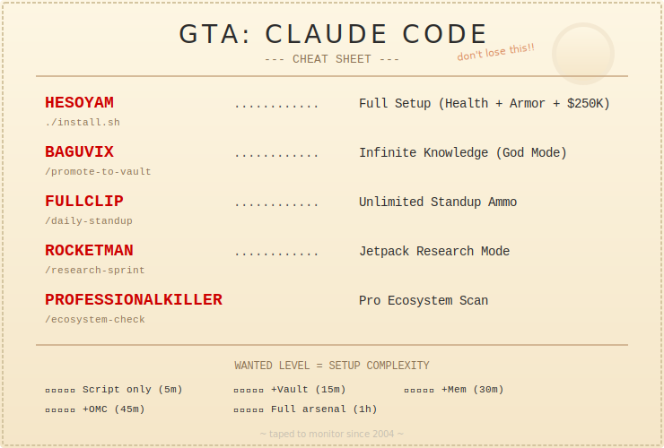
</p>

HESOYAM ships with four ready-to-use skills (slash commands) in `.claude/skills/`:

| Cheat Code | Skill | Command | GTA Effect |
|------------|-------|---------|------------|
| **`BAGUVIX`** | Promote to Vault | `/promote-to-vault` | **God Mode** — Reviews claude-mem observations, classifies them (decisions, debug breakthroughs, patterns, milestones), promotes to Obsidian vault with proper templates and linking. Knowledge becomes immortal. |
| **`FULLCLIP`** | Daily Standup | `/daily-standup` | **Unlimited Ammo** — Auto-generates standup reports from claude-mem + Obsidian daily notes. Never run out of status updates again. |
| **`ROCKETMAN`** | Research Sprint | `/research-sprint` | **Jetpack Mode** — Structured research sprint: define question, multi-dimensional research, comparison matrix, ADR, vault capture. Fly above the problem. |
| **`PROFESSIONALKILLER`** | Ecosystem Check | `/ecosystem-check` | **Pro Tools** — Monthly audit of upstream versions, new catalog additions, evaluation of new tools. Stay locked and loaded. |

> **Want to see all five pillars in action?** Check the **[example CLAUDE.md](examples/CLAUDE.md.example)** for a complete real-world configuration.

---

## 🕹️ A Day in the Life (with HESOYAM)

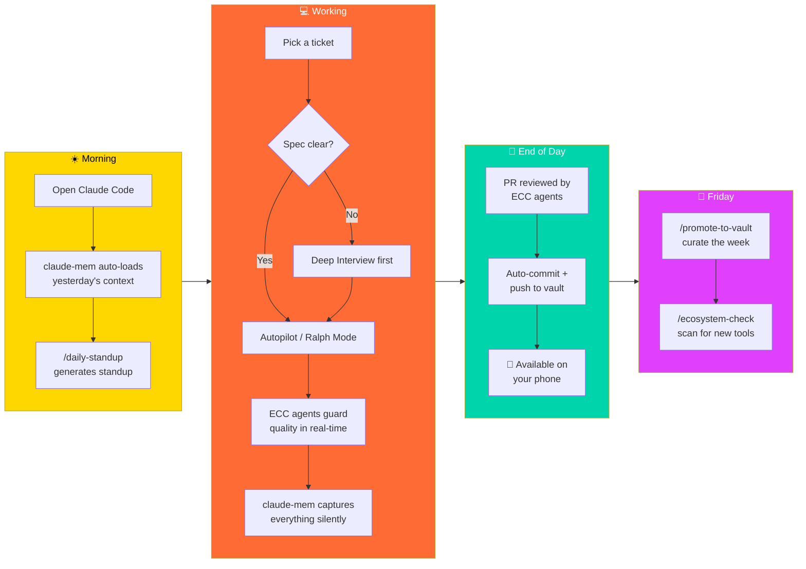

---

## 📂 Repo Structure

```
hesoyam-for-claude-code/
├── README.md                          # You are here
├── CONTRIBUTING.md                    # How to contribute
├── COMPATIBILITY.md                   # Version matrix & token budgets
├── CODE_OF_CONDUCT.md                 # Community standards
├── LICENSE                            # MIT
├── install.sh                         # Unified installer (real automation)
│
├── .github/workflows/ci.yml          # Markdown lint + link check + structure validation
│
├── .claude/skills/                    # Shipped skills (slash commands)
│   ├── promote-to-vault/SKILL.md      # /promote-to-vault — curate mem → Obsidian
│   ├── daily-standup/SKILL.md         # /daily-standup — auto-generate standups
│   ├── research-sprint/SKILL.md       # /research-sprint — structured research
│   └── ecosystem-check/SKILL.md      # /ecosystem-check — monthly tool audit
│
├── playbooks/                         # Orchestration playbooks
│   ├── sdlc-lifecycle.md              # Complete IT company SDLC (9 phases)
│   ├── greenfield-feature.md
│   ├── legacy-migration.md
│   ├── bug-hunt.md
│   ├── code-review-pipeline.md
│   └── sprint-execution.md
│
├── stacks/                            # Stack-specific starter configs
│   ├── dotnet-clean-architecture/
│   ├── java-spring-boot/             # Spring Boot 3.3+, hexagonal architecture
│   ├── nextjs-fullstack/
│   ├── python-django/                # Django 5+, DRF, Celery
│   ├── python-fastapi/
│   ├── ruby-rails/                   # Rails 7.2+, Hotwire, RSpec
│   ├── shopify-ecommerce/
│   └── kubernetes-platform/
│
├── examples/                          # Real-world examples
│   └── CLAUDE.md.example              # Full HESOYAM config for a real project
│
├── knowledge/                         # Knowledge pipeline templates
│   ├── obsidian-vault-template/
│   ├── templates/                     # Research & decision templates
│   │   ├── research-brief.md
│   │   ├── technology-evaluation.md
│   │   ├── adr-template.md
│   │   └── spike-report.md
│   ├── meeting-to-code-pipeline.md
│   ├── research-workflow.md
│   ├── daily-standup-automation.md
│   └── team-brain-architecture.md
│
├── guides/                            # Deep-dive guides
│   ├── pick-your-path.md              # 🛤️ START HERE — choose your setup level
│   ├── daily-usage.md                 # What people actually use daily (80/20)
│   ├── discovery-ecosystem.md         # 🔭 Tool discovery & evaluation guide
│   ├── token-optimization.md
│   ├── memory-strategies.md
│   ├── multi-agent-patterns.md
│   ├── claude-mem-obsidian-synergy.md # 🔗 The killer combination
│   ├── obsidian-setup.md
│   ├── obsidian-git-workflow.md       # 🔄 Version control your brain
│   ├── notebooklm-workflows.md
│   └── security.md                    # 🔒 Protecting your workflow
│
└── community/                         # Community contributions
    ├── showcase/                       # Real-world setups
    │   ├── solopreneur-saas/          # Solo dev SaaS build (3 pillars)
    │   └── devops-duo/                # 2-person platform team (all 5 pillars)
    ├── recipes/                        # Specific workflow recipes
    └── troubleshooting/               # Common issues & fixes
```

---

## 🤝 Contributing

**HESOYAM is a community cheat code. The more people contribute, the more powerful it gets.**

We welcome contributions of all kinds:

### What We Need Most

| Category | Examples |
|----------|---------|
| **Playbooks** | Real orchestration workflows you've battle-tested |
| **Stack Configs** | ECC configs tuned for specific tech stacks (Go/Echo, Rust/Axum, Flutter, etc.) |
| **Knowledge Pipelines** | Novel ways to connect Obsidian, NotebookLM, Granola, or other tools |
| **Recipes** | Step-by-step guides for specific outcomes ("Set up TDD with oh-my-claudecode") |
| **Showcase** | Screenshots or recordings of your setup in action |
| **Translations** | Help make these guides accessible in more languages |
| **Bug Reports** | Incompatibilities between pillars, install issues, etc. |

### How to Contribute

1. **Fork** this repo
2. **Create a branch** (`feature/my-awesome-playbook`)
3. **Add your contribution** following the structure above
4. **Open a PR** with a clear description of what you're adding and why
5. **Get reviewed** by the community

### First-Time Contributors

Look for issues tagged `good-first-issue`. These are specifically chosen to be approachable:

- Add a new stack config for your favorite framework
- Write a recipe for a workflow you use daily
- Translate a guide into your language
- Fix a typo or improve clarity in existing docs

### 🌍 Translations Welcome

This repo aims to be **accessible globally**. We especially welcome translations into:

Hindi · Mandarin · Spanish · Japanese · Korean · Portuguese · German · French · Arabic · Russian

If you're fluent in any of these (or any other language), please consider translating the core guides.

---

## 🙏 Credits & Acknowledgments

HESOYAM stands on the shoulders of giants. Every project referenced here represents hundreds (sometimes thousands) of hours of work by passionate developers. **Please star the original repos.**

| Project | Creator | Why It Matters |
|---------|---------|---------------|
| [oh-my-claudecode](https://github.com/Yeachan-Heo/oh-my-claudecode) | [@Yeachan-Heo](https://github.com/Yeachan-Heo) | Pioneered multi-agent orchestration for Claude Code |
| [everything-claude-code](https://github.com/affaan-m/everything-claude-code) | [@affaan-m](https://github.com/affaan-m) | Set the standard for Claude Code configuration (100K+ stars) |
| [awesome-claude-code](https://github.com/hesreallyhim/awesome-claude-code) | [@hesreallyhim](https://github.com/hesreallyhim) | Built the definitive ecosystem catalog (25K+ stars) |
| [claude-mem](https://github.com/thedotmack/claude-mem) | [@thedotmack](https://github.com/thedotmack) | Solved persistent memory with elegance |
| [claude-brain](https://github.com/memvid/claude-brain) | [memvid](https://github.com/memvid) | Single-file memory with sub-ms Rust core |
| [obsidian-skills](https://github.com/kepano/obsidian-skills) | [@kepano](https://github.com/kepano) | Official Obsidian agent skills |
| [claudesidian](https://github.com/heyitsnoah/claudesidian) | [@heyitsnoah](https://github.com/heyitsnoah) | AI-powered second brain vault template |
| [notebooklm-py](https://github.com/teng-lin/notebooklm-py) | [@teng-lin](https://github.com/teng-lin) | Unlocked programmatic NotebookLM access |
| [awesome-notebookLM-prompts](https://github.com/serenakeyitan/awesome-notebookLM-prompts) | [@serenakeyitan](https://github.com/serenakeyitan) | Field-tested slide prompts (1.6K stars) |
| [awesome-notebooklm](https://github.com/etewiah/awesome-notebooklm) | [@etewiah](https://github.com/etewiah) | NotebookLM ecosystem catalog |
| [open-notebook](https://github.com/lfnovo/open-notebook) | [@lfnovo](https://github.com/lfnovo) | Self-hosted NotebookLM alternative |
| [Claude Code](https://github.com/anthropics/claude-code) | [Anthropic](https://github.com/anthropics) | The foundation that makes all of this possible |

---

## ⭐ Star History

If this repo helped you, smash that star button. It helps other developers find the cheat code.

[](https://star-history.com/#Shashank2577/hesoyam-for-claude-code&Date)

*Every star is a developer who stopped grinding and started winning.*

---

## 📜 License

MIT — Use it, fork it, modify it, ship it. No wanted level. Just don't forget to star the original repos.

---

<p align="center">
  <b>Built by the Claude Code community</b><br/>
  <i>"All you had to do was type the damn cheat code, CJ."</i>
</p>
